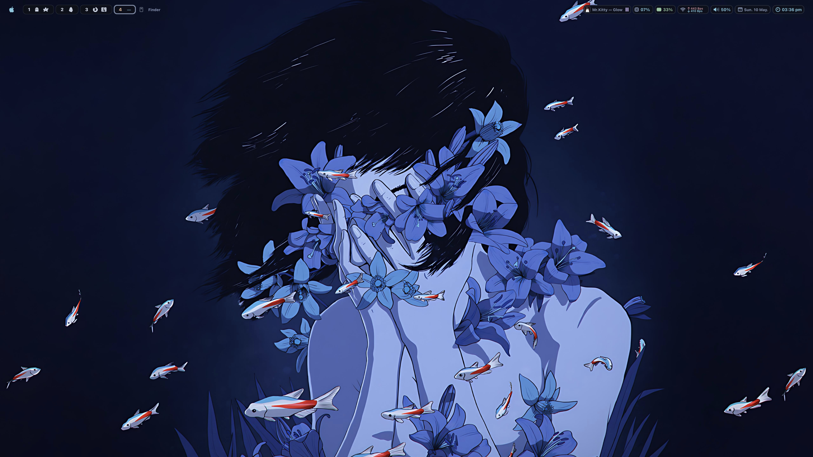
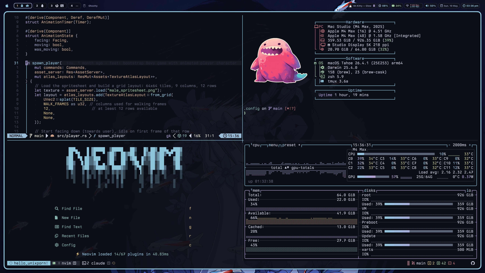

# dotfiles

my mac setup. nvim, ghostty, tmux, yabai, sketchybar.



## install

```bash
git clone git@github.com:Aejkatappaja/dotfiles.git ~/.config
```

no bootstrap script, pick what you need.

## stack

nvim (lazyvim), ghostty (custom sora theme), tmux (tokyo-night), yazi, lazygit, starship, sketchybar (lua, sora theme), yabai (stack layout, no SIP), janky borders, fastfetch.

theme is [sora](https://github.com/Aejkatappaja/sora), my own colorscheme. cool blue/black with one warm gold accent.

## screens




## structure

```
nvim/             lazyvim
ghostty/          ghostty + sora
kitty/            kitty
tmux/             tmux
yazi/             yazi
lazygit/          lazygit
sketchybar/       sketchybar lua
yabai/            yabai
borders/          janky borders
fastfetch/        fastfetch
firefox-start/    custom homepage
firefox-theme-sora/  sora browser theme
starship.toml     starship
bin/              scripts (b = brew helper)
wallpapers/       wallpapers
colorschemes/     sora exports
assets/           screenshots
```

## license

WTFPL.
