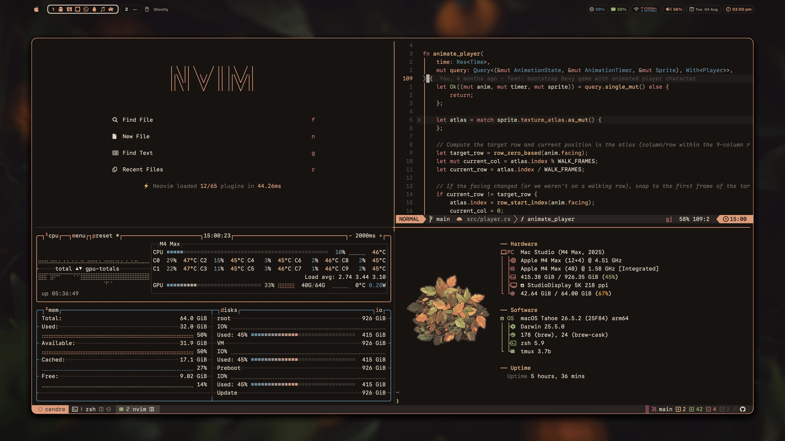
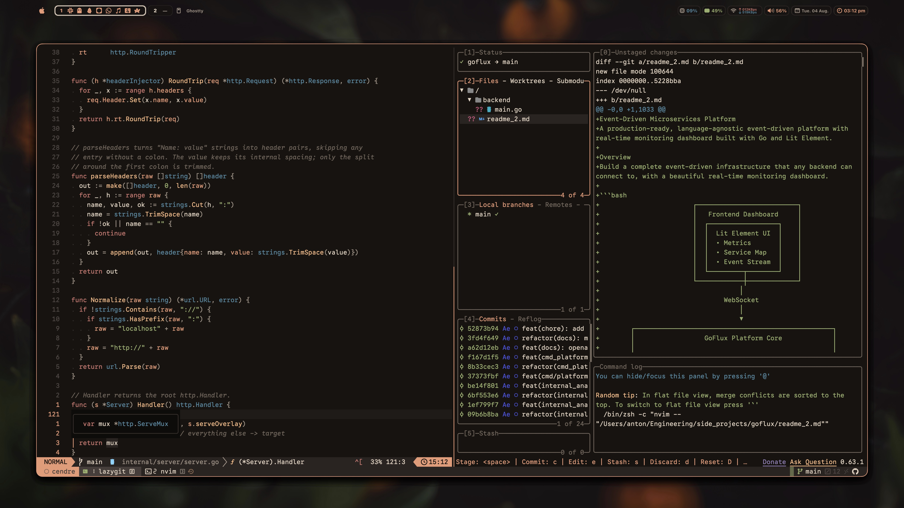
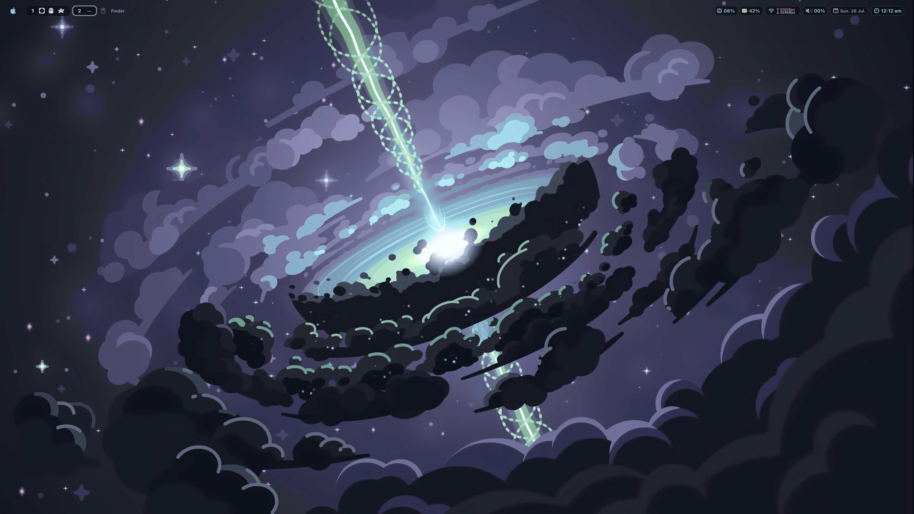
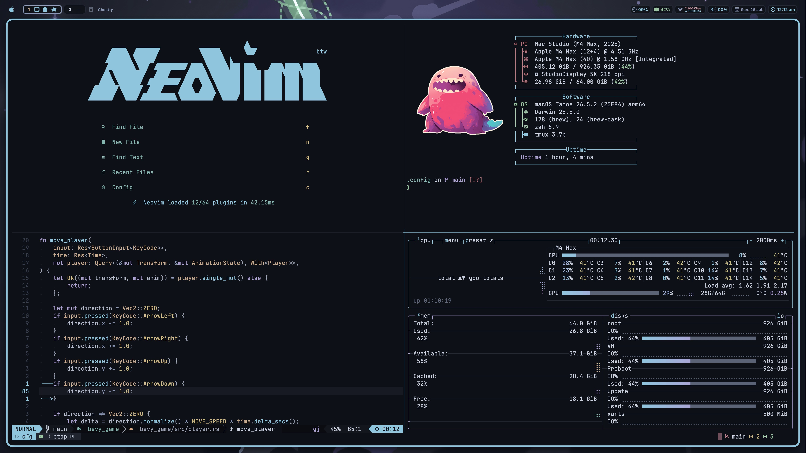
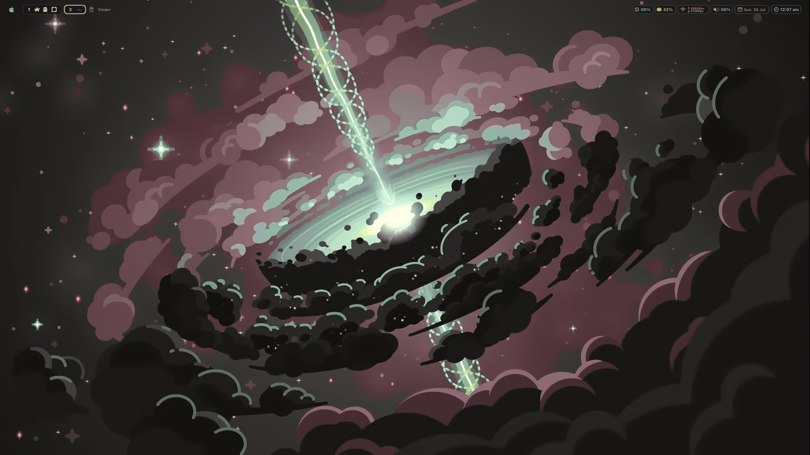
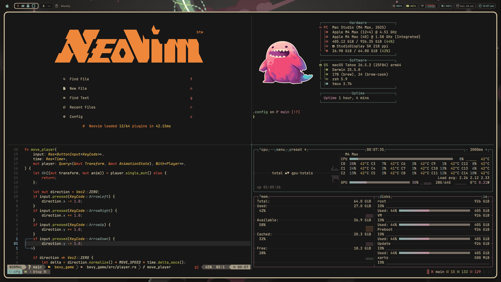
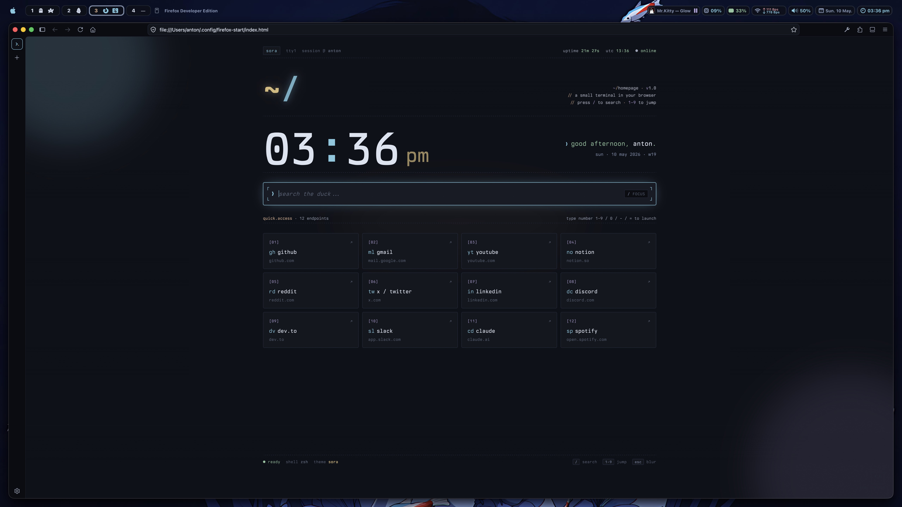

# dotfiles

my mac setup. nvim, ghostty, tmux, yabai, sketchybar, and one command to reskin all of it.



## install

```bash
git clone git@github.com:Aejkatappaja/dotfiles.git ~/.config
```

no bootstrap script, pick what you need.

## themes

three full themes. [cendre](https://github.com/Aejkatappaja/cendre) is the one running above: every hue computed from a wood fire spectrum rather than picked, dark only, three ground depths. [sora](https://github.com/Aejkatappaja/sora) is my other colorscheme, cool blue/black with a warm gold accent. gruvbox-material is a custom tune to match it.

`bin/theme` flips any of them across the whole setup in one shot:

```bash
theme            # toggle
theme cendre
theme sora
theme gruvbox
```

it drives 15 surfaces at once: nvim, ghostty, tmux, sketchybar, borders, wallpaper, bat, btop, yazi, hunk, lazygit, opencode, git-delta, obsidian, hlchunk. most update live, the rest on their next launch. there is a Raycast hotkey for the toggle too. full details in `bin/theme.md`.

## screens

cendre




sora




gruvbox-material




firefox start page



## stack

nvim (lazyvim), ghostty (custom themes, bg embedded), tmux (tokyo-night plugin), yazi, lazygit, bat, btop, hunk, opencode, git-delta, starship, sketchybar (lua), yabai (stack layout, no SIP), janky borders, fastfetch, obsidian.

## structure

```
bin/              scripts (theme = the switcher, b = brew helper)
nvim/             lazyvim
ghostty/          ghostty + themes
kitty/            kitty
tmux/             tmux
yazi/             yazi + theme snapshots
lazygit/          lazygit + theme snapshots
bat/              bat + themes
btop/             btop + themes
hunk/             hunk + theme snapshots
opencode/         opencode + themes
git/              git + delta gitconfigs
sketchybar/       sketchybar lua
yabai/            yabai
borders/          janky borders
fastfetch/        fastfetch
firefox-start/    custom homepage
firefox-theme-sora/  sora browser theme
starship.toml     starship
wallpapers/       wallpapers
colorschemes/     sora exports
assets/           screenshots
```

## license

WTFPL.
